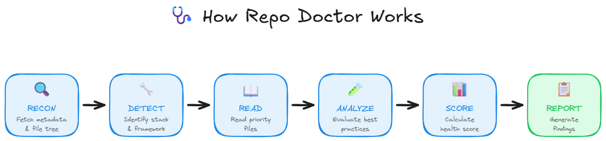

<p align="center">
  
</p>

<h1 align="center">🩺 Repo Doctor</h1>

<p align="center">
  <strong>AI-powered GitHub Repository Health Analyzer</strong><br>
  Built with the <a href="https://github.com/github/copilot-sdk">GitHub Copilot SDK</a> — the same AI agent runtime that powers Copilot CLI.
</p>

<p align="center">
  <a href="https://github.com/glaucia86/repo-doctor/stargazers">
    
  </a>
  <a href="https://github.com/glaucia86/repo-doctor/fork">
    
  </a>
  <a href="LICENSE">
    
  </a>
</p>

<p align="center">
  <a href="#-quick-start">Quick Start</a> •
  <a href="#-features">Features</a> •
  <a href="#-how-it-works">How It Works</a> •
  <a href="#-commands">Commands</a> •
  <a href="#-documentation">Documentation</a>
</p>

---

## 📖 Overview

**Repo Doctor** is your repository's AI doctor that diagnoses issues and prescribes solutions. It performs comprehensive health checks across **6 critical areas** — documentation, developer experience, CI/CD, testing, governance, and security — delivering a detailed diagnosis with prioritized findings (**P0/P1/P2**) and actionable remediation steps.

### Two Analysis Modes

| Mode | Description | Use Case |
|------|-------------|----------|
| 🔍 **Quick Scan** | Analyzes via GitHub API (up to 20 file reads) | Fast checks, governance review |
| 🔬 **Deep Analysis** | Full source scan using [Repomix](https://github.com/yamadashy/repomix) | Code quality, architecture review |

---

## ✨ Features

<table>
<tr>
<td width="50%">

### 🤖 AI-Powered Analysis
- **10+ AI Models** — GPT-4o, Claude Sonnet 4, o3, and more
- **Contextual Understanding** — Adapts to your stack
- **Evidence-Based** — Every finding backed by file evidence

</td>
<td width="50%">

### 📊 Comprehensive Reports
- **Health Score** — Overall percentage (0-100%)
- **Prioritized Findings** — P0 (critical), P1 (high), P2 (suggestions)
- **Actionable Steps** — Code snippets included

</td>
</tr>
<tr>
<td width="50%">

### 💬 Interactive CLI
- **Slash Commands** — `/analyze`, `/deep`, `/copy`, `/export`
- **Chat Interface** — Ask follow-up questions
- **Streaming Output** — Real-time analysis

</td>
<td width="50%">

### Auto-Publish Issues
- **One-Click Issue Creation** — `--issue` flag creates structured GitHub issues
- **Prioritized Findings** — P0/P1/P2 labels with detailed descriptions
- **Team Collaboration** — Automated tracking of repository health issues
- **CI/CD Integration** — Perfect for automated health checks

</td>
</tr>
<tr>
<td width="50%">

### 🔐 Security First
- **Prompt Injection Protection** — File content treated as data
- **Token Management** — Secure GitHub authentication
- **No Data Storage** — Analysis runs locally

</td>
</tr>
</table>

### 📢 Publishing Features

**Automatically publish analysis reports to GitHub as structured issues:**

#### 🚀 Auto-Create Issues for Each Problem Found
```bash
export GITHUB_TOKEN=ghp_xxx          # or REPO_DOCTOR_GITHUB_TOKEN, as configured
repo-doctor analyze owner/repo --issue
# Creates: 🔴 [Repo Doctor] docs: Missing README
#         🟠 [Repo Doctor] ci: No CI/CD Pipeline
#         🟡 [Repo Doctor] dx: Code Quality Issues
```

**Each issue includes:**
- **Detailed description** with evidence and impact assessment
- **Actionable fix instructions** with code examples
- **Priority labels** (P0/P1/P2) and category tags
- **Full analysis context** for team collaboration

#### 💬 Interactive Mode
```bash
# Set token securely (recommended)
export GITHUB_TOKEN=ghp_your_token_here

# Or use gh CLI auth
gh auth login

# Then start interactive mode
repo-doctor chat
/analyze facebook/react --issue
/deep microsoft/vscode
```

> [!TIP]
> Perfect for automated repository health tracking and team collaboration!

[📖 Learn how to set up GitHub tokens](docs/getting-started.md#testing-publishing-features)

---

## � Quick Start (5 minutes)

Want to see Repo Doctor create GitHub issues automatically?

```bash
# 1. Get a GitHub token (see detailed setup below)
# 2. Set it as environment variable
export GITHUB_TOKEN=ghp_your_token_here

# 3. Analyze and create issues automatically!
repo-doctor analyze your-username/your-repo --issue
```

**Result:** Multiple GitHub issues created with detailed analysis, impact assessment, and fix instructions! 🎉

### 🔑 Setting up GitHub Token

For the `--issue` feature, you'll need a GitHub Personal Access Token with specific permissions:

1. **Go to** [github.com/settings/tokens](https://github.com/settings/tokens)
2. **Generate** a new "Tokens (classic)"
3. **Select these scopes**:
   - `repo` (full repository access) **OR** the following granular permissions:
     - `metadata` — Read repository metadata
     - `contents` — Read repository contents
     - `issues` — Create and manage issues
4. **Copy** the token (starts with `ghp_`)

> [!IMPORTANT]
> [📖 Complete setup guide with screenshots](docs/getting-started.md#testing-publishing-features)

---

| Category | What's Checked | Example Findings |
|----------|----------------|------------------|
| 📚 **Docs & Onboarding** | README, setup instructions, contributing guidelines | Missing installation steps |
| ⚡ **Developer Experience** | Build scripts, language version, project structure | No `.nvmrc` or `.node-version` |
| 🔄 **CI/CD** | GitHub Actions, test automation, build pipelines | No CI workflow found |
| 🧪 **Quality & Tests** | Test framework, linting, formatting, coverage | Missing test configuration |
| 📋 **Governance** | LICENSE, CODE_OF_CONDUCT, SECURITY policy | No LICENSE file |
| 🔐 **Security** | Dependabot/Renovate, security policy, secret scanning | No dependency updates configured |

---

## 🚀 Quick Start

### Prerequisites

> [!IMPORTANT]
> - **GitHub Copilot** — Active subscription required
> - **Node.js** — Version 18.0.0 or higher

### Installation

```bash
# Clone the repository
git clone https://github.com/glaucia86/repo-doctor.git
cd repo-doctor

# Install dependencies and build
npm install
npm run build

# Link globally
npm link
```

### Usage

```bash
# Interactive mode
repo-doctor

# Direct analysis
repo-doctor vercel/next.js

# Deep analysis with premium model
repo-doctor vercel/next.js --model claude-sonnet-4 --deep

# 🚀 Auto-create GitHub issues for each problem found
repo-doctor vercel/next.js --issue
```

> [!NOTE]
> `--issue` requires a GitHub token. [Learn how to set it up](docs/getting-started.md#testing-publishing-features).

---

## 🔧 How It Works



---

## 📖 Commands

| Command | Description |
|---------|-------------|
| `/analyze <repo>` | Quick analysis via GitHub API |
| `/deep <repo>` | Deep analysis with full source scan |
| `/copy` | Copy last report to clipboard |
| `/export [path]` | Save report as markdown file |
| `/model [name]` | Switch AI model |
| `/help` | Show all available commands |
| `/quit` | Exit Repo Doctor |

> [!TIP]
> Use `/deep` for comprehensive code quality analysis. Use `/analyze` for quick governance checks.

---

## 🤖 Available AI Models

| Model | Type | Best For |
|-------|------|----------|
| `gpt-4o` | Free | Balanced performance (default) |
| `gpt-4.1` | Free | Fast analysis |
| `claude-sonnet-4` | Premium ⚡ | Detailed analysis |
| `claude-opus-4.5` | Premium ⚡ | Most capable (3x rate limit) |
| `o3` | Premium ⚡ | Deep reasoning tasks |

> [!NOTE]
> Premium models require GitHub Copilot Pro/Enterprise. See [AI Models Guide](docs/AI-MODELS.md) for full list.

---

## 📚 Documentation

| Document | Description |
|----------|-------------|
| [� Getting Started](docs/getting-started.md) | Installation and first analysis |
| [📖 User Guide](docs/GUIDE.md) | Complete usage guide with examples |
| [💻 Commands](docs/commands.md) | Full CLI command reference |
| [📊 Analysis Categories](docs/analysis-categories.md) | What gets analyzed in each category |
| [🤖 AI Models](docs/AI-MODELS.md) | Available models and recommendations |
| [🏗️ Architecture](docs/architecture.md) | Technical architecture and design |
| [❓ FAQ](docs/faq.md) | Frequently asked questions |
| [🔧 Troubleshooting](docs/troubleshooting.md) | Common issues and solutions |
| [🤝 Contributing](docs/CONTRIBUTING.md) | How to contribute to Repo Doctor |

> 📖 **Full documentation:** [docs/index.md](docs/index.md)

---

## 🏗️ Tech Stack

<table>
<tr>
<td align="center" width="120">
<a href="https://github.com/github/copilot-sdk">

</a>
<br><strong>Copilot SDK</strong>
<br><sub>AI Orchestration</sub>
</td>
<td align="center" width="120">
<a href="https://github.com/octokit/rest.js">

</a>
<br><strong>Octokit</strong>
<br><sub>GitHub API</sub>
</td>
<td align="center" width="120">
<a href="https://github.com/yamadashy/repomix">

</a>
<br><strong>Repomix</strong>
<br><sub>Repo Packing</sub>
</td>
<td align="center" width="120">
<a href="https://www.typescriptlang.org/">

</a>
<br><strong>TypeScript</strong>
<br><sub>Language</sub>
</td>
<td align="center" width="120">
<a href="https://github.com/colinhacks/zod">

</a>
<br><strong>Zod</strong>
<br><sub>Validation</sub>
</td>
</tr>
</table>

### 🔧 Modular Architecture

The codebase follows **SOLID principles** for maintainability:

```
src/
├── cli/          # Command handlers, state, parsers
├── core/agent/   # System prompts, event handling
├── tools/        # Individual tool files (SRP)
├── ui/display/   # Display modules (spinner, menus, etc.)
└── types/        # Zod schemas, interfaces
```

> 📖 See [Architecture Documentation](docs/architecture.md) for details.

---

## ⭐ Support This Project

If you find Repo Doctor useful:

<table>
<tr>
<td>⭐ <strong>Star</strong> this repository</td>
<td>🐛 <strong>Report</strong> issues you encounter</td>
</tr>
<tr>
<td>💡 <strong>Suggest</strong> new features</td>
<td>🔀 <strong>Contribute</strong> via pull requests</td>
</tr>
</table>

<p align="center">
  <a href="https://github.com/glaucia86/repo-doctor/issues">
    
  </a>
  <a href="https://github.com/glaucia86/repo-doctor/pulls">
    
  </a>
</p>

---

## 📈 Star History

<a href="https://star-history.com/#glaucia86/repo-doctor&Date">
  <picture>
    <source media="(prefers-color-scheme: dark)" srcset="https://api.star-history.com/svg?repos=glaucia86/repo-doctor&type=Date&theme=dark&v=20260123"/>
    <source media="(prefers-color-scheme: light)" srcset="https://api.star-history.com/svg?repos=glaucia86/repo-doctor&type=Date&v=20260123"/>
    
  </picture>
</a>

---

## 📄 License

MIT © [Glaucia Lemos](https://github.com/glaucia86)

---

## 👩‍💻 Author

<div align="center">
  <a href="https://github.com/glaucia86">
    
  </a>
  <br />
  <strong>Glaucia Lemos</strong>
  <br />
  <sub>A.I Developer at Zup Innovation/Itaú</sub>
  <br /><br />
  <a href="https://mvp.microsoft.com/pt-BR/MVP/profile/d3200941-395d-423b-a0ec-eb0577d3bb86">
    
  </a>
  <br /><br />
  <a href="https://twitter.com/glaucia_lemos86">🐦 Twitter</a> •
  <a href="https://www.linkedin.com/in/glaucialemos/">💼 LinkedIn</a> •
  <a href="https://github.com/glaucia86">🐙 GitHub</a>
</div>

---

<p align="center">
  Made with 💚 using the GitHub Copilot SDK
</p>

<p align="center">
  <a href="#-repo-doctor">⬆️ Back to Top</a>
</p>
