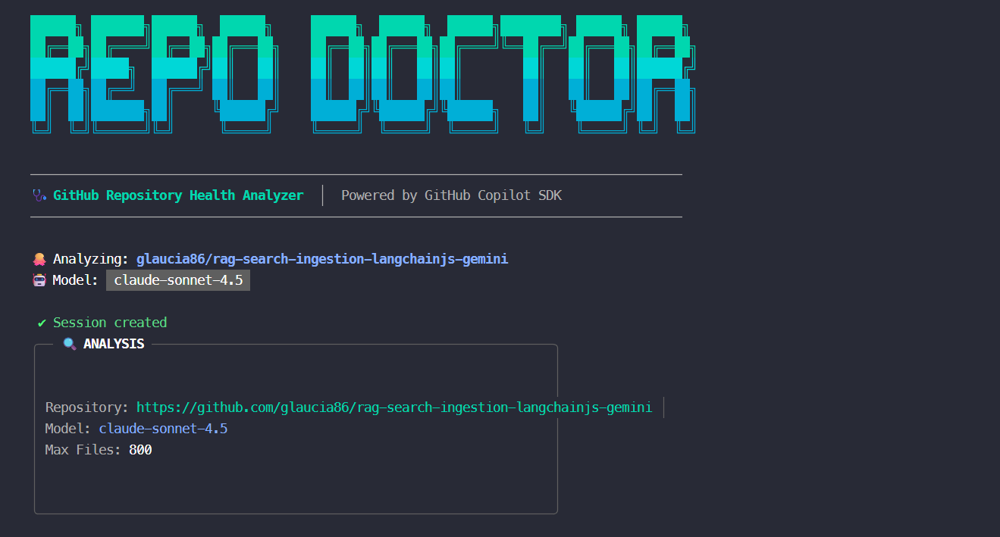

# 🩺 Repo Doctor

**AI-Powered GitHub Repository Health Analyzer** using the GitHub Copilot SDK.

Analyze any GitHub repository and get actionable insights to improve documentation, CI/CD, security, and developer experience.



[](LICENSE)
[](https://nodejs.org/)
[](https://www.typescriptlang.org/)
[](package.json)
[](https://github.com/glaucia86/repo-doctor)

---

## ⭐ Support This Project

If you find Repo Doctor useful, please consider:

- **⭐ Give it a star** - It helps others discover this tool
- **🐛 Report issues** - Help us improve by reporting bugs
- **💡 Suggest features** - Open an issue with your ideas
- **🔀 Contribute** - PRs are welcome!

[](https://github.com/glaucia86/repo-doctor/issues)
[](https://github.com/glaucia86/repo-doctor/pulls)

---

## ✨ Features

- **💬 Interactive Chat Interface** - Modern CLI with slash commands
- **🤖 10 AI Models** - Choose between free (GPT-4o, GPT-4.1, GPT-5 mini) and premium models
- **📊 Health Score** - Get an overall health percentage for your repository
- **📋 Clipboard Support** - Copy analysis results directly to clipboard
- **📝 Flexible Export** - Save reports to any location (home, desktop, custom path)
- **📜 Analysis History** - Track your previous analyses
- **🔍 Smart Diagnosis** - AI-powered analysis across 6 key categories
- **🎯 Prioritized Findings** - Issues classified as P0 (critical), P1 (high), P2 (nice-to-have)
- **💡 Actionable Recommendations** - Specific steps to improve your repository

## 🔍 What Gets Analyzed?

| Category | What's Checked |
|----------|----------------|
| 📚 **Docs & Onboarding** | README quality, setup instructions, contributing guidelines |
| ⚡ **Developer Experience** | npm scripts, Node version, TypeScript, monorepo setup |
| 🔄 **CI/CD** | GitHub Actions, test automation, build pipelines |
| 🧪 **Quality & Tests** | Test framework, linting, formatting, code coverage |
| 📋 **Governance** | LICENSE, CODE_OF_CONDUCT, SECURITY policy, templates |
| 🔐 **Security** | Dependabot/Renovate, security policy, secret management |

---

## 📋 Prerequisites

1. **GitHub Copilot** - Active subscription (individual, business, or enterprise)
2. **Node.js** - Version 18.0.0 or higher

## 🚀 Installation

```bash
# Clone the repository
git clone https://github.com/glaucia86/repo-doctor.git
cd repo-doctor

# Install dependencies
npm install

# Build and link globally
npm run build
npm link
```

---

## 📖 How to Use

### Quick Start

```bash
# Start interactive mode - will prompt for repository and model
repo-doctor

# Analyze a specific repository directly
repo-doctor vercel/next.js

# Analyze with a specific model
repo-doctor vercel/next.js --model gpt-4o
```

### Interactive Chat Mode

When you run `repo-doctor`, you enter an interactive chat interface:

```
╭─────────────────────────────────────────╮
│  🩺 REPO DOCTOR v2.0                    │
│     GitHub Repository Health Analyzer   │
╰─────────────────────────────────────────╯

  ✨ Welcome to Repo Doctor!
  
  Enter repository (owner/repo): vercel/next.js
  
  Select AI Model:
  ❯ claude-sonnet-4 (Premium)
    gpt-4o (Free)
    gpt-4.1 (Free)
    ...

  🔍 Analyzing repository...
```

After analysis, you'll see options to copy, export, or analyze another repository.

### Slash Commands

| Command | Description | Example |
|---------|-------------|---------|
| `/analyze <repo>` | Analyze a repository | `/analyze vercel/next.js` |
| `/last` | Show last analysis result | `/last` |
| `/history` | Show recent analyses | `/history` |
| `/copy` | Copy analysis to clipboard | `/copy` |
| `/export [path] [format]` | Export report to file | `/export ~/Desktop` |
| `/model [name]` | Switch AI model | `/model gpt-4o` |
| `/clear` | Clear the screen | `/clear` |
| `/help` | Show available commands | `/help` |
| `/quit` | Exit Repo Doctor | `/quit` |

### Export Options

The `/export` command supports flexible paths:

```bash
# Save to default location: ~/repo-doctor/reports/
/export

# Save to Desktop
/export ~/Desktop

# Save with custom filename
/export ./my-report.md

# Save as JSON
/export ~/Documents json

# Save to specific path as JSON
/export ~/Desktop/analysis.json
```

Reports are saved with UTF-8 encoding (with BOM) to preserve emojis correctly.

### Command Line Options

```bash
repo-doctor [repository] [options]

Options:
  --token <TOKEN>     GitHub token for private repos (or set GITHUB_TOKEN env)
  --model <name>      AI model to use (default: claude-sonnet-4)
  --max-files <N>     Maximum files to analyze (default: 800)
  --max-bytes <N>     Maximum bytes per file (default: 200KB)
  --timeout <ms>      Analysis timeout (default: 120000)
  --export            Export report after analysis
  --help              Show help
```

### Examples

```bash
# Analyze a public repository
repo-doctor microsoft/typescript

# Analyze with full URL
repo-doctor https://github.com/facebook/react

# Analyze a private repository
export GITHUB_TOKEN=ghp_xxxxx
repo-doctor owner/private-repo

# Use a free model
repo-doctor vercel/next.js --model gpt-4o

# Auto-export after analysis
repo-doctor vercel/next.js --export
```

---

## 🤖 Available AI Models

| Model | Type | Description |
|-------|------|-------------|
| `gpt-4o` | ✅ Free | Fast, efficient - works for all Copilot users |
| `gpt-4.1` | ✅ Free | Latest GPT-4 variant |
| `gpt-5-mini` | ✅ Free | Lightweight GPT-5 |
| `claude-sonnet-4` | ⚡ Premium | Default model, requires Copilot Pro/Business |
| `claude-sonnet-4.5` | ⚡ Premium | Enhanced Sonnet |
| `claude-opus-4.5` | ⚡ Premium | Most capable (3x rate limit) |
| `gpt-5` | ⚡ Premium | Preview model |
| `gpt-5.1-codex` | ⚡ Premium | Optimized for code |
| `gpt-5.2-codex` | ⚡ Premium | Latest Codex variant |
| `o3` | ⚡ Premium | Reasoning model |

> 💡 **Tip:** If you have a free Copilot subscription, use `gpt-4o` or `gpt-4.1` for the best experience.

---

## 🎯 Priority Levels

| Priority | Meaning | Examples |
|----------|---------|----------|
| **P0** | Critical blocker | No LICENSE, no README, no CI |
| **P1** | High impact | CI without tests, no CONTRIBUTING guide |
| **P2** | Nice to have | Badges, refined templates |

---

## 🛠️ Development

```bash
# Install dependencies
npm install

# Run in development mode
npm run dev

# Build for production
npm run build

# Run tests
npm test
```

## 🏗️ Architecture

```
repo-doctor/
├── src/
│   ├── index.ts              # Entry point
│   ├── cli.ts                # Commander setup + chat loop
│   ├── core/
│   │   ├── agent.ts          # Copilot SDK integration
│   │   ├── analyzer.ts       # Analysis engine
│   │   ├── markdownReporter.ts
│   │   └── reporter.ts
│   ├── providers/
│   │   └── github.ts         # GitHub API client
│   ├── tools/
│   │   └── repoTools.ts      # Custom agent tools
│   ├── ui/
│   │   ├── themes.ts         # Colors and icons
│   │   ├── display.ts        # Screen rendering
│   │   ├── commands.ts       # Slash command parsing
│   │   └── prompts.ts
│   └── types/
│       └── schema.ts
├── resources/
│   └── image-repo-doctor.png
└── ai-documents/
    ├── spec.md
    ├── PRD.md
    └── AGENTS.md
```

## 🏗️ Tech Stack

- **[@github/copilot-sdk](https://github.com/github/copilot-sdk)** - AI orchestration
- **[@octokit/rest](https://github.com/octokit/rest.js)** - GitHub API client
- **[commander](https://github.com/tj/commander.js)** - CLI framework
- **[chalk](https://github.com/chalk/chalk)** - Terminal styling
- **[ora](https://github.com/sindresorhus/ora)** - Terminal spinners
- **[zod](https://github.com/colinhacks/zod)** - Schema validation

---

## 🤝 Contributing

Contributions are welcome! Here's how you can help:

1. **Fork** the repository
2. **Create** a feature branch: `git checkout -b feature/amazing-feature`
3. **Commit** your changes: `git commit -m 'Add amazing feature'`
4. **Push** to the branch: `git push origin feature/amazing-feature`
5. **Open** a Pull Request

Please read our contributing guidelines and code of conduct before submitting.

---

## 📄 License

MIT © [Glaucia Lemos](https://github.com/glaucia86)

---

## 👩‍💻 Author

<table>
  <tr>
    <td align="center">
      <a href="https://github.com/glaucia86">
        
        <br />
        <sub><b>Glaucia Lemos</b></sub>
      </a>
      <br />
      <a href="https://twitter.com/glaucialemos">Twitter</a> •
      <a href="https://www.linkedin.com/in/glaucialemos/">LinkedIn</a> •
      <a href="https://glaucialemos.dev/">Blog</a>
    </td>
  </tr>
</table>

**Cloud Advocate at Microsoft** | Developer | Speaker | Open Source Contributor

---

<p align="center">
  Made with 💚 using the GitHub Copilot SDK
</p>

<p align="center">
  <a href="https://github.com/glaucia86/repo-doctor/stargazers">
    
  </a>
</p>