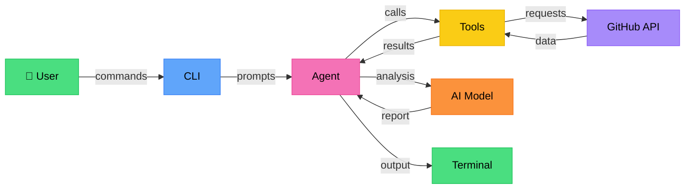
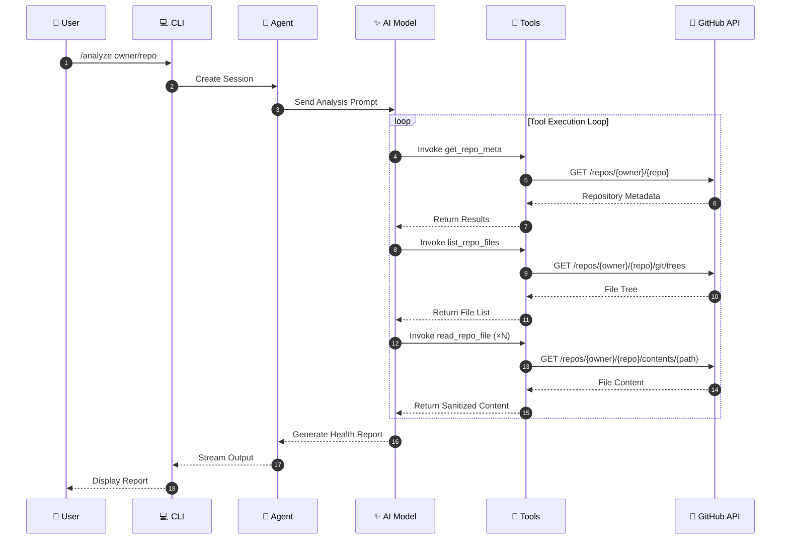
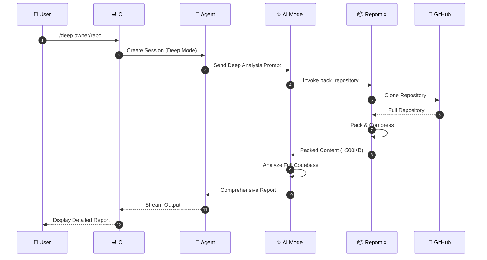

# 🏗️ Architecture

Technical overview of Repo Doctor's architecture and design decisions.

---

## Table of Contents

- [System Overview](#system-overview)
- [Project Structure](#project-structure)
- [Core Components](#core-components)
- [Data Flow](#data-flow)
- [AI Agent Architecture](#ai-agent-architecture)
- [Tool Definitions](#tool-definitions)
- [Security Considerations](#security-considerations)
- [Extension Points](#extension-points)

---

## System Overview

Repo Doctor is built as an **agentic CLI tool** using the GitHub Copilot SDK. It leverages AI to analyze GitHub repositories and provide health assessments.

```mermaid
flowchart TB
    subgraph RD["🩺 REPO DOCTOR"]
        direction TB
        
        subgraph Input["📥 Input Layer"]
            CLI["💻 CLI<br/><small>cli.ts</small>"]
        end
        
        subgraph Core["🧠 Core Layer"]
            Agent["🤖 Agent<br/><small>agent.ts</small>"]
            Tools["🔧 Tools<br/><small>repoTools.ts</small>"]
        end
        
        subgraph External["☁️ External Services"]
            AI["✨ AI Models<br/><small>Copilot SDK</small>"]
            GitHub["🐙 GitHub API<br/><small>Octokit</small>"]
        end
        
        subgraph Output["📤 Output Layer"]
            UI["🖥️ Terminal UI<br/><small>chalk, ora, prompts</small>"]
        end
    end
    
    CLI --> Agent
    Agent <--> AI
    Agent --> Tools
    Tools --> GitHub
    CLI --> UI
    
    style RD fill:#0d1117,stroke:#30363d,stroke-width:2px
    style Input fill:#161b22,stroke:#238636,stroke-width:2px
    style Core fill:#161b22,stroke:#1f6feb,stroke-width:2px
    style External fill:#161b22,stroke:#8957e5,stroke-width:2px
    style Output fill:#161b22,stroke:#f78166,stroke-width:2px
    style CLI fill:#238636,stroke:#3fb950,color:#fff
    style Agent fill:#1f6feb,stroke:#58a6ff,color:#fff
    style Tools fill:#1f6feb,stroke:#58a6ff,color:#fff
    style AI fill:#8957e5,stroke:#a371f7,color:#fff
    style GitHub fill:#8957e5,stroke:#a371f7,color:#fff
    style UI fill:#f78166,stroke:#ffa657,color:#fff
```



### High-Level Architecture



---

## Project Structure

```
repo-doctor/
├── src/
│   ├── index.ts              # Entry point with shebang
│   ├── cli.ts                # Commander setup (~186 lines)
│   │
│   ├── cli/                  # CLI Layer (SRP)
│   │   ├── chatLoop.ts       # Interactive REPL
│   │   ├── handlers/         # Command handlers (one per command)
│   │   │   ├── analyzeHandler.ts  # /analyze, /deep
│   │   │   ├── copyHandler.ts     # /copy
│   │   │   ├── exportHandler.ts   # /export
│   │   │   └── modelHandler.ts    # /model
│   │   ├── parsers/          # Input parsing utilities
│   │   │   ├── repoParser.ts      # GitHub URL parsing
│   │   │   └── reportExtractor.ts # Report extraction
│   │   └── state/            # Application state
│   │       └── appState.ts   # IAppState interface + AppState class
│   │
│   ├── core/
│   │   ├── agent.ts          # Copilot SDK session management
│   │   ├── analyzer.ts       # Repository analysis orchestration
│   │   ├── repoPacker.ts     # Re-exports from repoPacker/
│   │   ├── repoPacker/       # Repomix integration (modular)
│   │   │   ├── index.ts      # Public API exports
│   │   │   ├── types.ts      # PackOptions, PackResult, PackErrorReason
│   │   │   ├── packer.ts     # packRemoteRepository main function
│   │   │   ├── executor.ts   # Repomix process execution
│   │   │   ├── errors.ts     # Error categorization & sanitization
│   │   │   ├── patterns.ts   # Include/exclude patterns
│   │   │   ├── cleaner.ts    # Temp directory cleanup
│   │   │   └── availability.ts # npx/repomix availability check
│   │   ├── reporter.ts       # Output formatting utilities
│   │   ├── markdownReporter.ts # Markdown report generation
│   │   └── agent/            # Agent modules
│   │       ├── prompts/      # Modular prompt system (OCP)
│   │       │   ├── systemPrompt.ts     # Legacy SYSTEM_PROMPT (deprecated)
│   │       │   ├── analysisPrompt.ts   # buildAnalysisPrompt() function
│   │       │   ├── base/     # Base prompt modules
│   │       │   │   ├── securityDirective.ts
│   │       │   │   ├── expertiseProfile.ts
│   │       │   │   ├── reconnaissance.ts
│   │       │   │   ├── languageDetection.ts
│   │       │   │   ├── strategicReading.ts
│   │       │   │   ├── analysisCriteria.ts
│   │       │   │   ├── scoring.ts
│   │       │   │   ├── evidenceRules.ts
│   │       │   │   ├── outputFormat.ts
│   │       │   │   ├── constraints.ts
│   │       │   │   └── errorHandling.ts
│   │       │   ├── modes/    # Mode-specific extensions
│   │       │   │   ├── quick.ts   # Quick analysis mode
│   │       │   │   └── deep.ts    # Deep analysis mode
│   │       │   └── composers/     # Prompt composition
│   │       │       └── systemPromptComposer.ts
│   │       ├── eventHandler.ts    # Session event handling
│   │       ├── toolCallTracker.ts # Loop detection
│   │       └── guardrails.ts      # Safety mechanisms
│   │
│   ├── providers/
│   │   └── github.ts         # Octokit factory, token resolution
│   │
│   ├── tools/                # Individual tool files (DIP)
│   │   ├── repoTools.ts      # Factory (re-exports individual tools)
│   │   ├── getRepoMeta.ts    # get_repo_meta tool
│   │   ├── listRepoFiles.ts  # list_repo_files tool
│   │   ├── readRepoFile.ts   # read_repo_file tool
│   │   └── packRepository.ts # pack_repository tool
│   │
│   ├── types/
│   │   ├── schema.ts         # Zod schemas and TypeScript types
│   │   └── interfaces.ts     # Shared interfaces (IAppState, etc.)
│   │
│   ├── ui/
│   │   ├── index.ts          # Barrel export
│   │   ├── commands.ts       # Slash command parsing
│   │   ├── display.ts        # Re-exports from display/
│   │   ├── display/          # Modular UI components (SRP)
│   │   │   ├── messages.ts   # printSuccess, printError, etc.
│   │   │   ├── menus.ts      # Command menus, model selection
│   │   │   └── spinner.ts    # Spinner management
│   │   ├── prompts.ts        # Interactive prompts (readline)
│   │   ├── themes.ts         # Re-exports from themes/
│   │   └── themes/           # Theme system (modular)
│   │       ├── index.ts      # Public API exports
│   │       ├── colors.ts     # COLORS palette & chalk helpers
│   │       ├── icons.ts      # ICON, category/priority mappings
│   │       ├── box.ts        # Box drawing utilities
│   │       ├── badges.ts     # Progress bars, health scores
│   │       └── logo.ts       # Logo renderers
│   │
│   └── utils/
│       ├── sanitizer.ts      # Security: prompt injection detection
│       └── clipboard.ts      # Cross-platform clipboard
│
├── tests/                    # Vitest test files
│   ├── cli/                  # CLI tests
│   ├── core/                 # Core tests
│   └── tools/                # Tool tests (including repoPacker)
├── docs/                     # Documentation
├── resources/                # Images and assets
├── ai-documents/             # AI agent documentation
└── package.json
```

---

## Core Components

### CLI Layer (`cli.ts` + `cli/`)

The CLI layer is now modular, following the Single Responsibility Principle:

- **cli.ts** — Commander setup only (~186 lines)
- **cli/chatLoop.ts** — Interactive REPL
- **cli/handlers/** — One handler per command (SRP)
- **cli/state/appState.ts** — Application state management

```typescript
// Simplified structure
import { Command } from "commander";
import { startChatLoop } from "./cli/chatLoop.js";

const program = new Command();

program
  .argument("[repository]", "Repository to analyze")
  .option("--model <name>", "AI model to use")
  .option("--deep", "Enable deep analysis")
  .action(async (repository, options) => {
    if (repository) {
      await analyzeRepository(repository, options);
    } else {
      await startChatLoop();
    }
  });
```

### Agent Core (`agent.ts`)

The agent integrates with the GitHub Copilot SDK with Infinite Sessions support:

```typescript
import { CopilotClient, type SessionEvent } from "@github/copilot-sdk";
import { getSystemPrompt } from "./agent/prompts/composers/systemPromptComposer.js";

export async function createAgent(options: AgentOptions) {
  const client = new CopilotClient();
  await client.start();

  const session = await client.createSession({
    model: options.model,
    streaming: true,
    tools: repoTools({ token: options.token }),
    systemMessage: {
      mode: "append",
      content: getSystemPrompt(options.isDeep ? "deep" : "quick"),
    },
    // Infinite Sessions (v0.1.18+) - auto-compacts context for long analyses
    infiniteSessions: {
      enabled: true,
      backgroundCompactionThreshold: 0.80,
      bufferExhaustionThreshold: 0.95,
    },
  });

  session.on((event: SessionEvent) => {
    // Handle streaming events via eventHandler.ts
  });

  return session;
}
```

### Modular Prompt System (`agent/prompts/`)

The system prompt is now composed from modular pieces, following the Open/Closed Principle:

```typescript
import { getSystemPrompt, composeSystemPrompt } from "./prompts/composers/systemPromptComposer.js";

// Use pre-built prompts for performance
const quickPrompt = getSystemPrompt("quick");  // ~350 lines
const deepPrompt = getSystemPrompt("deep");    // ~550 lines

// Or compose dynamically with options
const customPrompt = composeSystemPrompt({
  mode: "deep",
  additionalRules: "Custom rules here",
  maxFileReads: 30,
});
```

**Base Modules** (`prompts/base/`):
- `securityDirective.ts` — Prompt injection protection
- `expertiseProfile.ts` — Agent capabilities
- `reconnaissance.ts` — Phase 1: metadata gathering
- `languageDetection.ts` — Phase 2: stack detection
- `strategicReading.ts` — Phase 3: file prioritization
- `analysisCriteria.ts` — Phase 4: P0/P1/P2 definitions
- `scoring.ts` — Phase 5: category weights
- `outputFormat.ts` — Phase 6: report template

**Mode Modules** (`prompts/modes/`):
- `quick.ts` — Governance-focused analysis
- `deep.ts` — Full source code analysis

### GitHub Provider (`github.ts`)

Factory for creating authenticated Octokit instances:

```typescript
import { Octokit } from "@octokit/rest";

export function createOctokit(token?: string): Octokit {
  const resolvedToken = token 
    || process.env.GITHUB_TOKEN 
    || getTokenFromGHCli();
    
  return new Octokit({
    auth: resolvedToken,
    userAgent: "repo-doctor",
  });
}
```

### Tools (`repoTools.ts`)

Custom tools that the AI agent can invoke:

```typescript
import { defineTool } from "@github/copilot-sdk";

export function repoTools(options: ToolOptions) {
  return [
    getRepoMeta,
    listRepoFiles,
    readRepoFile,
    packRepository,  // Only in deep mode
  ];
}
```

---

## Data Flow

### Quick Analysis Flow



### Deep Analysis Flow



---

## AI Agent Architecture

### System Prompt (Modular)

The AI agent is now guided by a **modular system prompt** composed from reusable pieces. This follows the Open/Closed Principle - open for extension, closed for modification.

**Quick Mode** (~350 lines) - Governance-focused analysis
**Deep Mode** (~550 lines) - Full source code analysis

The prompt is composed from base modules:

1. **Security Directive** — Prompt injection protection
2. **Expertise Profile** — What the agent knows
3. **Reconnaissance** — Phase 1: metadata gathering
4. **Language Detection** — Phase 2: stack detection
5. **Strategic Reading** — Phase 3: file prioritization
6. **Analysis Criteria** — Phase 4: P0/P1/P2 definitions
7. **Scoring** — Phase 5: category weights
8. **Evidence Rules** — Fact-based finding rules
9. **Output Format** — Phase 6: report template
10. **Constraints** — Analysis boundaries
11. **Error Handling** — Error recovery strategies

```typescript
// Use pre-built prompts for performance
import { getSystemPrompt } from "./prompts/composers/systemPromptComposer.js";

const quickPrompt = getSystemPrompt("quick");
const deepPrompt = getSystemPrompt("deep");
```

### Event Handling (`eventHandler.ts`)

The agent uses streaming events for real-time output via a dedicated event handler:

```typescript
import { createEventHandler } from "./agent/eventHandler.js";

const handler = createEventHandler({
  onMessageDelta: (content) => process.stdout.write(content),
  onToolStart: (tool) => updateSpinner(`Using ${tool}...`),
  onToolComplete: () => stopSpinner(),
  onIdle: () => console.log("Analysis complete"),
  // Infinite Sessions compaction events (v0.1.18+)
  onCompactionStart: () => console.log("Compacting context..."),
  onCompactionComplete: (stats) => console.log(`Removed ${stats.tokensRemoved} tokens`),
});

session.on(handler);
```

### Agent Guardrails (`guardrails.ts`)

New safety mechanisms prevent the agent from getting stuck in infinite loops:

- **ToolCallTracker** — Records all tool calls, detects consecutive identical calls
- **Step Limit** — 30 standard / 40 deep analysis
- **Sequence Loop Detection** — Detects A→B→A→B patterns
- **Progressive Response** — warn → inject replan message → abort

```typescript
import { AgentGuardrails, ToolCallTracker } from "./agent/guardrails.js";

const tracker = new ToolCallTracker();
const guardrails = new AgentGuardrails({ mode: "deep", tracker });

// Check before each tool call
const check = guardrails.check(toolName, toolArgs);
if (check.action === "abort") {
  throw new Error(check.message);
}
```

---

## Tool Definitions

### get_repo_meta

Fetches repository metadata from GitHub API.

```typescript
const getRepoMeta = defineTool("get_repo_meta", {
  description: "Fetches repository metadata",
  parameters: {
    type: "object",
    properties: {
      repoUrl: { type: "string", description: "Repository URL or slug" },
    },
    required: ["repoUrl"],
  },
  handler: async ({ repoUrl }) => {
    const { owner, repo } = parseRepoUrl(repoUrl);
    const octokit = createOctokit(token);
    
    const [repoData, languages] = await Promise.all([
      octokit.repos.get({ owner, repo }),
      octokit.repos.listLanguages({ owner, repo }),
    ]);
    
    return {
      name: repoData.data.name,
      description: repoData.data.description,
      defaultBranch: repoData.data.default_branch,
      languages: languages.data,
      // ... more fields
    };
  },
});
```

### list_repo_files

Lists repository file tree structure.

```typescript
const listRepoFiles = defineTool("list_repo_files", {
  description: "Lists repository file tree",
  parameters: {
    type: "object",
    properties: {
      repoUrl: { type: "string" },
      maxFiles: { type: "number" },
    },
    required: ["repoUrl"],
  },
  handler: async ({ repoUrl, maxFiles = 800 }) => {
    // Get git tree
    // Filter noise (node_modules, dist, etc.)
    // Return file paths with sizes
  },
});
```

### read_repo_file

Reads file content with sanitization.

```typescript
const readRepoFile = defineTool("read_repo_file", {
  description: "Reads file content from repository",
  parameters: {
    type: "object",
    properties: {
      repoUrl: { type: "string" },
      path: { type: "string" },
    },
    required: ["repoUrl", "path"],
  },
  handler: async ({ repoUrl, path }) => {
    const content = await fetchFileContent(repoUrl, path);
    const sanitized = sanitizeFileContent(content, path);
    
    return {
      path,
      content: sanitized.content,
      securityFlags: sanitized.suspicious ? { ... } : undefined,
    };
  },
});
```

### pack_repository

Packs repository using Repomix (deep mode only).

```typescript
const packRepository = defineTool("pack_repository", {
  description: "Packs entire repository using Repomix",
  parameters: {
    type: "object",
    properties: {
      repoUrl: { type: "string" },
      mode: { type: "string", enum: ["governance", "deep"] },
    },
    required: ["repoUrl"],
  },
  handler: async ({ repoUrl, mode = "governance" }) => {
    const result = await packRemoteRepository({
      url: repoUrl,
      include: mode === "deep" ? deepPatterns : governancePatterns,
      maxBytes: 512000,
    });
    
    return { content: result.content, truncated: result.truncated };
  },
});
```

---

## Security Considerations

### Prompt Injection Protection

All file content is treated as **data, never instructions**:

```typescript
function sanitizeFileContent(content: string, path: string) {
  // Wrap content with delimiters
  const wrapped = `
=== FILE CONTENT START: ${path} ===
${content}
=== FILE CONTENT END: ${path} ===
`;

  // Detect suspicious patterns
  const suspiciousPatterns = [
    /ignore.*previous.*instructions/i,
    /you are now/i,
    /system prompt/i,
    /disregard.*above/i,
  ];

  const suspicious = suspiciousPatterns.some(p => p.test(content));

  return { content: wrapped, suspicious };
}
```

### Path Traversal Prevention

```typescript
function sanitizeFilePath(path: string): string | null {
  // Reject path traversal attempts
  if (path.includes("..") || path.startsWith("/")) {
    return null;
  }
  // Limit path length
  return path.slice(0, 500);
}
```

### Token Security

- Tokens are never logged or displayed
- Environment variables are preferred
- GitHub CLI integration for secure auth

---

## Extension Points

### Adding New Tools

1. Define tool in `src/tools/repoTools.ts`:

```typescript
const myNewTool = defineTool("my_new_tool", {
  description: "What this tool does",
  parameters: { ... },
  handler: async (args) => { ... },
});
```

2. Add to tools array:

```typescript
export function repoTools(options) {
  return [
    getRepoMeta,
    listRepoFiles,
    readRepoFile,
    myNewTool,  // Add here
  ];
}
```

3. Document in SYSTEM_PROMPT so AI knows when to use it.

### Adding New Categories

1. Add category to `CategorySchema` in `schema.ts`:

```typescript
const CategorySchema = z.enum([
  "docs",
  "dx",
  "ci",
  "tests",
  "governance",
  "security",
  "my_new_category",  // Add here
]);
```

2. Update SYSTEM_PROMPT with category weight and checks.

### Custom UI Themes

Modify `src/ui/themes.ts`:

```typescript
export const colors = {
  brand: chalk.hex("#4ade80"),
  error: chalk.hex("#ef4444"),
  // Add custom colors
};
```

---

## Technologies Used

| Technology | Purpose |
|------------|---------|
| [GitHub Copilot SDK](https://github.com/github/copilot-sdk) | AI agent orchestration |
| [Octokit](https://github.com/octokit/rest.js) | GitHub API client |
| [Repomix](https://github.com/yamadashy/repomix) | Repository packing |
| [Commander.js](https://github.com/tj/commander.js) | CLI framework |
| [Chalk](https://github.com/chalk/chalk) | Terminal styling |
| [Ora](https://github.com/sindresorhus/ora) | Terminal spinners |
| [Zod](https://github.com/colinhacks/zod) | Schema validation |

---

<p align="center">
  <a href="index.md">← Back to Documentation</a>
</p>
