# 🏗️ Architecture

Technical overview of Repo Doctor's architecture and design decisions.

---

## Table of Contents

- [System Overview](#system-overview)
- [Project Structure](#project-structure)
- [Core Components](#core-components)
- [Data Flow](#data-flow)
- [AI Agent Architecture](#ai-agent-architecture)
- [Tool Definitions](#tool-definitions)
- [Security Considerations](#security-considerations)
- [Extension Points](#extension-points)

---

## System Overview

Repo Doctor is built as an **agentic CLI tool** using the GitHub Copilot SDK. It leverages AI to analyze GitHub repositories and provide health assessments.

```mermaid
flowchart TB
    subgraph RD["🩺 REPO DOCTOR"]
        direction TB
        
        subgraph Input["📥 Input Layer"]
            CLI["💻 CLI<br/><small>cli.ts</small>"]
        end
        
        subgraph Core["🧠 Core Layer"]
            Agent["🤖 Agent<br/><small>agent.ts</small>"]
            Tools["🔧 Tools<br/><small>repoTools.ts</small>"]
        end
        
        subgraph External["☁️ External Services"]
            AI["✨ AI Models<br/><small>Copilot SDK</small>"]
            GitHub["🐙 GitHub API<br/><small>Octokit</small>"]
        end
        
        subgraph Output["📤 Output Layer"]
            UI["🖥️ Terminal UI<br/><small>chalk, ora, prompts</small>"]
        end
    end
    
    CLI --> Agent
    Agent <--> AI
    Agent --> Tools
    Tools --> GitHub
    CLI --> UI
    
    style RD fill:#0d1117,stroke:#30363d,stroke-width:2px
    style Input fill:#161b22,stroke:#238636,stroke-width:2px
    style Core fill:#161b22,stroke:#1f6feb,stroke-width:2px
    style External fill:#161b22,stroke:#8957e5,stroke-width:2px
    style Output fill:#161b22,stroke:#f78166,stroke-width:2px
    style CLI fill:#238636,stroke:#3fb950,color:#fff
    style Agent fill:#1f6feb,stroke:#58a6ff,color:#fff
    style Tools fill:#1f6feb,stroke:#58a6ff,color:#fff
    style AI fill:#8957e5,stroke:#a371f7,color:#fff
    style GitHub fill:#8957e5,stroke:#a371f7,color:#fff
    style UI fill:#f78166,stroke:#ffa657,color:#fff
```



### High-Level Architecture


---

## Project Structure

```
repo-doctor/
├── site/                     # Static website (GitHub Pages)
│
├── src/
│   ├── index.ts              # Package entrypoint (bin)
│   ├── cli.ts                # Compatibility entrypoint -> presentation/cli.ts
│   ├── presentation/         # UI/transport layer
│   │   ├── cli.ts            # CLI composition root
│   │   ├── cli/              # chat loop, handlers, state, parsers
│   │   ├── ui/               # terminal rendering
│   │   ├── api/              # local HTTP API routes/jobs
│   │   └── web/              # local Web UI server/public client
│   ├── application/
│   │   └── core/             # analysis orchestration, agent flow, reporting
│   ├── infrastructure/
│   │   ├── providers/        # GitHub/Copilot provider adapters
│   │   └── tools/            # Copilot SDK tool adapters
│   ├── domain/
│   │   ├── shared/           # contracts and shared domain types
│   │   └── types/            # schemas, publish/types, interfaces
│   └── utils/                # cross-cutting utilities
│
├── tests/                    # Vitest test files
│   ├── cli/                  # CLI tests
│   ├── core/                 # Core tests
│   └── tools/                # Tool tests (including repoPacker)
├── docs/                     # Documentation
├── resources/                # Images and assets
├── ai-documents/             # AI agent documentation
└── package.json
```

---

## Diagrams

Architecture and flow diagrams can be maintained in Excalidraw source format.

- Source file: `resources/how-it-works.excalidraw`
- Optional exported image for docs/site: `resources/how-it-works.png`

Tip: keep `.excalidraw` as the source of truth and export PNG/SVG only for rendering targets that do not support Excalidraw natively.

---

## Core Components

### Presentation Layer (`src/presentation/*`)

The presentation layer is modular, following the Single Responsibility Principle:

- **src/presentation/cli.ts** — CLI composition root
- **src/presentation/cli/chatLoop.ts** — Interactive REPL
- **src/presentation/cli/handlers/** — One handler per command
- **src/presentation/api/** — Local HTTP API
- **src/presentation/web/** — Local Web UI server and client

```typescript
// Simplified structure
import { Command } from "commander";
import { startChatLoop } from "./cli/chatLoop.js";

const program = new Command();

program
  .argument("[repository]", "Repository to analyze")
  .option("--model <name>", "AI model to use")
  .option("--deep", "Enable deep analysis")
  .action(async (repository, options) => {
    if (repository) {
      await analyzeRepository(repository, options);
    } else {
      await startChatLoop();
    }
  });
```

### Application Core (`src/application/core/agent.ts`)

The agent integrates with the GitHub Copilot SDK with Infinite Sessions support:

```typescript
import { CopilotClient, type SessionEvent } from "@github/copilot-sdk";
import { getSystemPrompt } from "./agent/prompts/composers/systemPromptComposer.js";

export async function createAgent(options: AgentOptions) {
  const client = new CopilotClient();
  await client.start();

  const session = await client.createSession({
    model: options.model,
    streaming: true,
    tools: repoTools({ token: options.token }),
    systemMessage: {
      mode: "append",
      content: getSystemPrompt(options.isDeep ? "deep" : "quick"),
    },
    // Infinite Sessions (v0.1.18+) - auto-compacts context for long analyses
    infiniteSessions: {
      enabled: true,
      backgroundCompactionThreshold: 0.80,
      bufferExhaustionThreshold: 0.95,
    },
  });

  session.on((event: SessionEvent) => {
    // Handle streaming events via eventHandler.ts
  });

  return session;
}
```

### Modular Prompt System (`agent/prompts/`)

The system prompt is now composed from modular pieces, following the Open/Closed Principle:

```typescript
import { getSystemPrompt, composeSystemPrompt } from "./prompts/composers/systemPromptComposer.js";

// Use pre-built prompts for performance
const quickPrompt = getSystemPrompt("quick");  // ~350 lines
const deepPrompt = getSystemPrompt("deep");    // ~550 lines

// Or compose dynamically with options
const customPrompt = composeSystemPrompt({
  mode: "deep",
  additionalRules: "Custom rules here",
  maxFileReads: 30,
});
```

**Base Modules** (`prompts/base/`):
- `securityDirective.ts` — Prompt injection protection
- `expertiseProfile.ts` — Agent capabilities
- `reconnaissance.ts` — Phase 1: metadata gathering
- `languageDetection.ts` — Phase 2: stack detection
- `strategicReading.ts` — Phase 3: file prioritization
- `analysisCriteria.ts` — Phase 4: P0/P1/P2 definitions
- `scoring.ts` — Phase 5: category weights
- `outputFormat.ts` — Phase 6: report template

**Mode Modules** (`prompts/modes/`):
- `quick.ts` — Governance-focused analysis
- `deep.ts` — Full source code analysis

### GitHub Provider (`github.ts`)

Factory for creating authenticated Octokit instances:

```typescript
import { Octokit } from "@octokit/rest";

export function createOctokit(token?: string): Octokit {
  const resolvedToken = token 
    || process.env.GITHUB_TOKEN 
    || getTokenFromGHCli();
    
  return new Octokit({
    auth: resolvedToken,
    userAgent: "repo-doctor",
  });
}
```

### Tools (`src/infrastructure/tools/repoTools.ts`)

Custom tools that the AI agent can invoke:

```typescript
import { defineTool } from "@github/copilot-sdk";

export function repoTools(options: ToolOptions) {
  return [
    getRepoMeta,
    listRepoFiles,
    readRepoFile,
    packRepository,  // Only in deep mode
  ];
}
```

---

## Data Flow

### Quick Analysis Flow

```mermaid
sequenceDiagram
    autonumber
    participant U as 👤 User
    participant C as 💻 CLI
    participant A as 🤖 Agent
    participant AI as ✨ AI Model
    participant T as 🔧 Tools
    participant G as 🐙 GitHub API

    U->>C: /analyze owner/repo
    C->>A: Create Session
    A->>AI: Send Analysis Prompt
    
    loop Tool Execution Loop
        AI->>T: Invoke get_repo_meta
        T->>G: GET /repos/{owner}/{repo}
        G-->>T: Repository Metadata
        T-->>AI: Return Results
        
        AI->>T: Invoke list_repo_files
        T->>G: GET /repos/{owner}/{repo}/git/trees
        G-->>T: File Tree
        T-->>AI: Return File List
        
        AI->>T: Invoke read_repo_file (×N)
        T->>G: GET /repos/{owner}/{repo}/contents/{path}
        G-->>T: File Content
        T-->>AI: Return Sanitized Content
    end
    
    AI-->>A: Generate Health Report
    A-->>C: Stream Output
    C-->>U: Display Report
```



### Deep Analysis Flow

```mermaid
sequenceDiagram
    autonumber
    participant U as 👤 User
    participant C as 💻 CLI
    participant A as 🤖 Agent
    participant AI as ✨ AI Model
    participant R as 📦 Repomix
    participant G as 🐙 GitHub

    U->>C: /deep owner/repo
    C->>A: Create Session (Deep Mode)
    A->>AI: Send Deep Analysis Prompt
    
    AI->>R: Invoke pack_repository
    R->>G: Clone Repository
    G-->>R: Full Repository
    R->>R: Pack & Compress
    R-->>AI: Packed Content (~500KB)
    
    AI->>AI: Analyze Full Codebase
    AI-->>A: Comprehensive Report
    A-->>C: Stream Output
    C-->>U: Display Detailed Report
```



---

## AI Agent Architecture

### System Prompt (Modular)

The AI agent is now guided by a **modular system prompt** composed from reusable pieces. This follows the Open/Closed Principle - open for extension, closed for modification.

**Quick Mode** (~350 lines) - Governance-focused analysis
**Deep Mode** (~550 lines) - Full source code analysis

The prompt is composed from base modules:

1. **Security Directive** — Prompt injection protection
2. **Expertise Profile** — What the agent knows
3. **Reconnaissance** — Phase 1: metadata gathering
4. **Language Detection** — Phase 2: stack detection
5. **Strategic Reading** — Phase 3: file prioritization
6. **Analysis Criteria** — Phase 4: P0/P1/P2 definitions
7. **Scoring** — Phase 5: category weights
8. **Evidence Rules** — Fact-based finding rules
9. **Output Format** — Phase 6: report template
10. **Constraints** — Analysis boundaries
11. **Error Handling** — Error recovery strategies

```typescript
// Use pre-built prompts for performance
import { getSystemPrompt } from "./prompts/composers/systemPromptComposer.js";

const quickPrompt = getSystemPrompt("quick");
const deepPrompt = getSystemPrompt("deep");
```

### Event Handling (`eventHandler.ts`)

The agent uses streaming events for real-time output via a dedicated event handler:

```typescript
import { createEventHandler } from "./agent/eventHandler.js";

const handler = createEventHandler({
  onMessageDelta: (content) => process.stdout.write(content),
  onToolStart: (tool) => updateSpinner(`Using ${tool}...`),
  onToolComplete: () => stopSpinner(),
  onIdle: () => console.log("Analysis complete"),
  // Infinite Sessions compaction events (v0.1.18+)
  onCompactionStart: () => console.log("Compacting context..."),
  onCompactionComplete: (stats) => console.log(`Removed ${stats.tokensRemoved} tokens`),
});

session.on(handler);
```

### Agent Guardrails (`guardrails.ts`)

New safety mechanisms prevent the agent from getting stuck in infinite loops:

- **ToolCallTracker** — Records all tool calls, detects consecutive identical calls
- **Step Limit** — 30 standard / 40 deep analysis
- **Sequence Loop Detection** — Detects A→B→A→B patterns
- **Progressive Response** — warn → inject replan message → abort

```typescript
import { AgentGuardrails, ToolCallTracker } from "./agent/guardrails.js";

const tracker = new ToolCallTracker();
const guardrails = new AgentGuardrails({ mode: "deep", tracker });

// Check before each tool call
const check = guardrails.check(toolName, toolArgs);
if (check.action === "abort") {
  throw new Error(check.message);
}
```

---

## Tool Definitions

### get_repo_meta

Fetches repository metadata from GitHub API.

```typescript
const getRepoMeta = defineTool("get_repo_meta", {
  description: "Fetches repository metadata",
  parameters: {
    type: "object",
    properties: {
      repoUrl: { type: "string", description: "Repository URL or slug" },
    },
    required: ["repoUrl"],
  },
  handler: async ({ repoUrl }) => {
    const { owner, repo } = parseRepoUrl(repoUrl);
    const octokit = createOctokit(token);
    
    const [repoData, languages] = await Promise.all([
      octokit.repos.get({ owner, repo }),
      octokit.repos.listLanguages({ owner, repo }),
    ]);
    
    return {
      name: repoData.data.name,
      description: repoData.data.description,
      defaultBranch: repoData.data.default_branch,
      languages: languages.data,
      // ... more fields
    };
  },
});
```

### list_repo_files

Lists repository file tree structure.

```typescript
const listRepoFiles = defineTool("list_repo_files", {
  description: "Lists repository file tree",
  parameters: {
    type: "object",
    properties: {
      repoUrl: { type: "string" },
      maxFiles: { type: "number" },
    },
    required: ["repoUrl"],
  },
  handler: async ({ repoUrl, maxFiles = 800 }) => {
    // Get git tree
    // Filter noise (node_modules, dist, etc.)
    // Return file paths with sizes
  },
});
```

### read_repo_file

Reads file content with sanitization.

```typescript
const readRepoFile = defineTool("read_repo_file", {
  description: "Reads file content from repository",
  parameters: {
    type: "object",
    properties: {
      repoUrl: { type: "string" },
      path: { type: "string" },
    },
    required: ["repoUrl", "path"],
  },
  handler: async ({ repoUrl, path }) => {
    const content = await fetchFileContent(repoUrl, path);
    const sanitized = sanitizeFileContent(content, path);
    
    return {
      path,
      content: sanitized.content,
      securityFlags: sanitized.suspicious ? { ... } : undefined,
    };
  },
});
```

### pack_repository

Packs repository using Repomix (deep mode only).

```typescript
const packRepository = defineTool("pack_repository", {
  description: "Packs entire repository using Repomix",
  parameters: {
    type: "object",
    properties: {
      repoUrl: { type: "string" },
      mode: { type: "string", enum: ["governance", "deep"] },
    },
    required: ["repoUrl"],
  },
  handler: async ({ repoUrl, mode = "governance" }) => {
    const result = await packRemoteRepository({
      url: repoUrl,
      include: mode === "deep" ? deepPatterns : governancePatterns,
      maxBytes: 512000,
    });
    
    return { content: result.content, truncated: result.truncated };
  },
});
```

---

## Security Considerations

### Prompt Injection Protection

All file content is treated as **data, never instructions**:

```typescript
function sanitizeFileContent(content: string, path: string) {
  // Wrap content with delimiters
  const wrapped = `
=== FILE CONTENT START: ${path} ===
${content}
=== FILE CONTENT END: ${path} ===
`;

  // Detect suspicious patterns
  const suspiciousPatterns = [
    /ignore.*previous.*instructions/i,
    /you are now/i,
    /system prompt/i,
    /disregard.*above/i,
  ];

  const suspicious = suspiciousPatterns.some(p => p.test(content));

  return { content: wrapped, suspicious };
}
```

### Path Traversal Prevention

```typescript
function sanitizeFilePath(path: string): string | null {
  // Reject path traversal attempts
  if (path.includes("..") || path.startsWith("/")) {
    return null;
  }
  // Limit path length
  return path.slice(0, 500);
}
```

### Token Security

- Tokens are never logged or displayed
- Environment variables are preferred
- GitHub CLI integration for secure auth

Repo Doctor uses two auth paths:
- Copilot SDK auth via GitHub CLI OAuth token (exported as `GH_TOKEN`)
- GitHub API auth for repo access and `--issue` via PAT (`GITHUB_TOKEN` or `--token`)

---

## Extension Points

### Adding New Tools

1. Define tool in `src/infrastructure/tools/repoTools.ts`:

```typescript
const myNewTool = defineTool("my_new_tool", {
  description: "What this tool does",
  parameters: { ... },
  handler: async (args) => { ... },
});
```

2. Add to tools array:

```typescript
export function repoTools(options) {
  return [
    getRepoMeta,
    listRepoFiles,
    readRepoFile,
    myNewTool,  // Add here
  ];
}
```

3. Document in SYSTEM_PROMPT so AI knows when to use it.

### Adding New Categories

1. Add category to `CategorySchema` in `schema.ts`:

```typescript
const CategorySchema = z.enum([
  "docs",
  "dx",
  "ci",
  "tests",
  "governance",
  "security",
  "my_new_category",  // Add here
]);
```

2. Update SYSTEM_PROMPT with category weight and checks.

### Custom UI Themes

Modify `src/presentation/ui/themes.ts`:

```typescript
export const colors = {
  brand: chalk.hex("#4ade80"),
  error: chalk.hex("#ef4444"),
  // Add custom colors
};
```

---

## Technologies Used

| Technology | Purpose |
|------------|---------|
| [GitHub Copilot SDK](https://github.com/github/copilot-sdk) | AI agent orchestration |
| [Octokit](https://github.com/octokit/rest.js) | GitHub API client |
| [Repomix](https://github.com/yamadashy/repomix) | Repository packing |
| [Commander.js](https://github.com/tj/commander.js) | CLI framework |
| [Chalk](https://github.com/chalk/chalk) | Terminal styling |
| [Ora](https://github.com/sindresorhus/ora) | Terminal spinners |
| [Zod](https://github.com/colinhacks/zod) | Schema validation |

---

<p align="center">
  <a href="index.md">← Back to Documentation</a>
</p>
